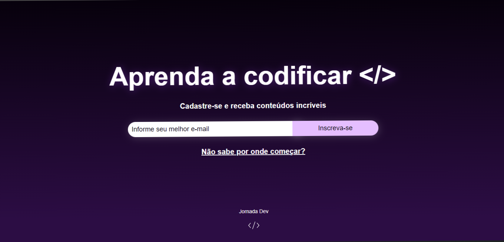

<h1 align="center">Tela de Cadastro</h1>

Projeto desenvolvido com objetivo de adquirir experiências em Desenvolvimento Web.  

 

  

## 🚀 Tecnologias

Esse projeto foi desenvolvido com as seguintes tecnologias:

- HTML5
- CSS3
- JavaScript

## 💻 Projeto

A Tela de Cadastro é um projeto para usuários que desejam receber informações através de e-mail.
